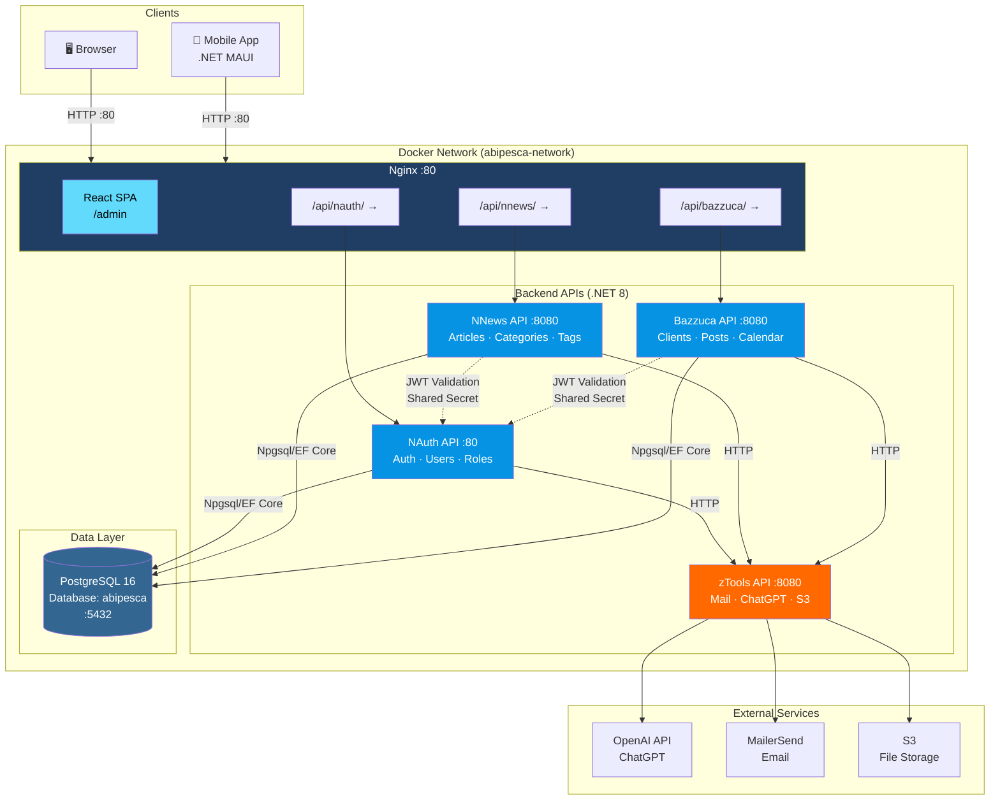
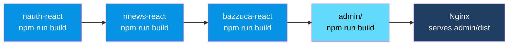
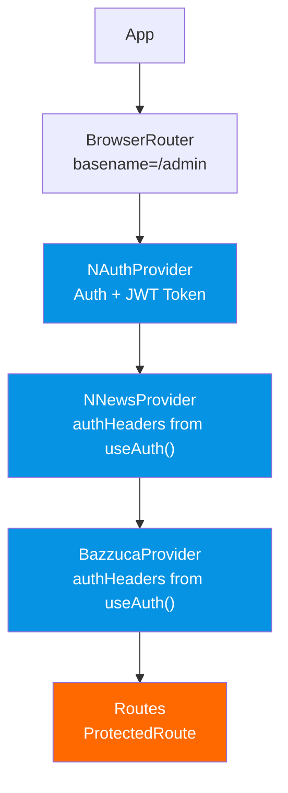

# Abipesca - System Design

## Build Pipeline (Nginx Dockerfile - Multi-stage)

## Frontend Provider Architecture

## Tech Stack

| Layer | Technology |
|-------|-----------|
| Frontend | React 19 · Vite 7 · TypeScript 5.9 · Tailwind 3.4 |
| UI Libraries | lucide-react · sonner · react-quill-new · @radix-ui/react-dialog |
| Backend APIs | .NET 8 · ASP.NET Core |
| Database | PostgreSQL 16 · Npgsql · EF Core |
| Auth | JWT (shared secret across all APIs) |
| Mobile | .NET MAUI |
| Infrastructure | Docker · Nginx · docker-compose |
| External | OpenAI · MailerSend · S3 |
